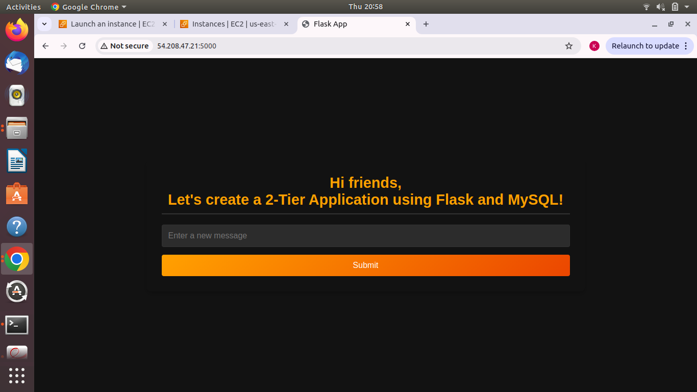

 
# Flask App with MySQL Docker Setup

This is a simple Flask app that interacts with a MySQL database. The app allows users to submit messages, which are then stored in the database and displayed on the frontend.

## Prerequisites

Before you begin, make sure you have the following installed:

- Docker
- Docker-compose
- Git (optional, for cloning the repository)
  
## Setup

1. Clone this repository 

   ```bash
   git clone https://https://github.com/Archana-DevOps05/two-tier-flask-app
   ```

2. Navigate to the project directory:

   ```bash
   cd two-tier-flask-app
   ```
   
3. Create a `.env` file in the project directory to store your MySQL environment variables:

   ```bash
   touch .env
   ```

4. Open the `.env` file and add your MySQL configuration:

   ```
   MYSQL_HOST=mysql
   MYSQL_USER=root
   MYSQL_PASSWORD=admin
   MYSQL_DB=mydb
   
## To run this two-tier application using  Dockerfile.

1. - First create a docker image from Dockerfile
```bash
docker build -t flask-app .
```

2. - Now, you have created a network using following command
```bash
docker network create -d two-tier
```

- Attach both the containers in the same network, so that they can communicate with each other

i) MySQL container 
```bash
docker run -d \
    --name mysql \
    -v mysql-data:/var/lib/mysql \
    --network=two-tier \
    -e MYSQL_DATABASE=mydb \
    -e MYSQL_ROOT_PASSWORD=admin \
    -p 3306:3306 \
    mysql:5.7

```
ii) Backend container
```bash
docker run -d \
    --name flask-app \
    --network=two-tier \
    -e MYSQL_HOST=mysql \
    -e MYSQL_USER=root \
    -e MYSQL_PASSWORD=admin \
    -e MYSQL_DB=mydb \
    -p 5000:5000 \
    flaskapp:latest

```

4.Create the messages table in your MySQL database:

Use a MySQL client or tool (e.g., phpMyAdmin) to execute the following SQL commands:

CREATE TABLE messages (
    id INT AUTO_INCREMENT PRIMARY KEY,
    message TEXT
);
   
5. Access the Flask app in your web browser:

   - Frontend: http://localhost
   - Backend: http://localhost:5000
   
## To run this two-tier application using  using docker-compose

## Usage

1. Start the containers using Docker Compose:

   ```bash
   docker-compose up --build


## Cleaning Up

2. To stop and remove the Docker containers, press `Ctrl+C` in the terminal where the containers are running, or use the following command:

```bash
docker-compose down
```


Now you can access your flask-app in the browser at:  
**http://localhost:5000** or  if you are using AWS EC2 instance you can use their own public ip

# Result:



